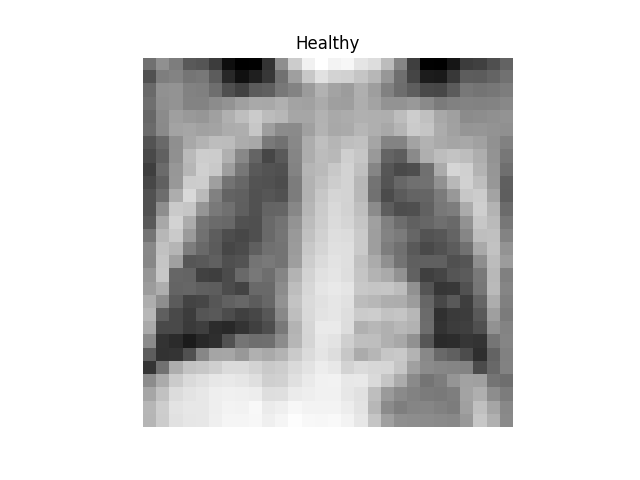
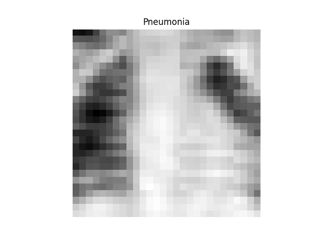

Convolutional neural network to classify images of the [PneumoniaMNIST](https://zenodo.org/records/10519652) dataset.
For educational purposes.

  
   

The model hyperparameters are tuned with [KerasTuner](https://keras.io/keras_tuner/)
using the [Hyperband](https://arxiv.org/abs/1603.06560) optimization algorithms. The 
hyperparameters are:
* Learning rate
* Number of convolutional layers
* Number of convolutional filters
* Dropout
* Number of neurons in the dense layer

A utility function is also available for plotting the feature maps (random channels):

